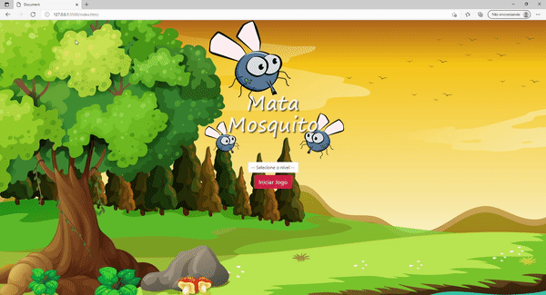

  <a href="#-tecnologias">Tecnologias</a>&nbsp;&nbsp;&nbsp;|&nbsp;&nbsp;&nbsp;
  <a href="#-projeto">Projeto</a>&nbsp;&nbsp;&nbsp;|&nbsp;&nbsp;&nbsp;
  <a href="#-layout">Layout</a>&nbsp;&nbsp;&nbsp;|&nbsp;&nbsp;&nbsp;
  <a href="#memo-licença">Licença</a>

 

  

<h1 align="center">
  App Mata Mosquito
</h1>  &nbsp;&nbsp;&nbsp;&nbsp;

 

  <kbd>
    
  </kbd>
  &nbsp;&nbsp;&nbsp;&nbsp;

  ## 🚀 Tecnologias

Esse projeto foi desenvolvido com as seguintes tecnologias:

- HTML
- CSS
- JavaScrip

## 💻 Projeto

Este projeto é uma aplicativo no formato de jogo, construída como aprendizado na linguagem JavaScrip.

## 🔖 Layout

Criado por [Udemy.](https://www.udemy.com/)

## 📝 Licença

Esse projeto está sob a licença MIT. Veja o arquivo [LICENSE](.github/LICENSE.md) para mais detalhes.

---

Feito com ♥ by Priscilla Rarimmy :wave:
